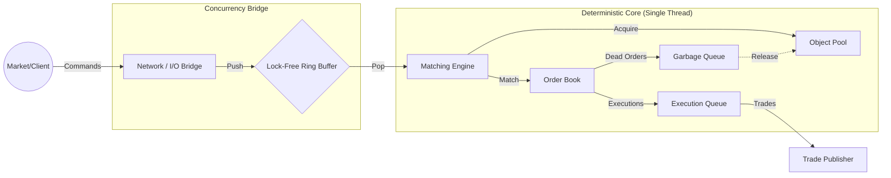

# Sequitur HFT Matching Engine

Sequitur is a deterministic, ultra-low latency C++ matching engine designed for high-frequency algorithmic trading (HFT). Built with strict hardware sympathy, the project investigates the limits of single-threaded deterministic execution, lock-free concurrency, and zero-allocation memory management to achieve sub-microsecond "Tick-to-Trade" latencies.

The engine implements a pure Price-Time Priority limit order book, wrapping the core math in a bounded, lock-free Ring Buffer to eliminate operating system context switches and mutex contention during high-throughput market events.

## Performance Analysis

Benchmarks were conducted on the isolated deterministic core (bypassing network and I/O) to establish the absolute hardware baseline of the C++ math. The benchmark utilized a strict alternating "ping-pong" sequence (Buy/Sell) to violently exercise the annihilation logic and memory pool at maximum velocity.

### Key Metrics

| Metric | Result | Notes |
| :--- | :--- | :--- |
| **Peak Throughput** | 37,000,000 OPS | Orders Per Second (Theoretical max of pure engine). |
| **Average Latency** | 27.00 ns | Tick-to-Trade latency per order inside the hot path. |
| **Memory Allocation** | O(1) | Zero heap allocations during runtime execution. |
| **State Verification** | 100% Deterministic | 1,000,000 orders yielded exactly 500,000 crossed trades. |

**Conclusion:** The purely single-threaded deterministic core is currently executing well within the CPU's L1/L2 cache regime. The 27-nanosecond average proves that the custom memory pool completely bypasses the OS-level `malloc`/`new` bottlenecks.

## Architecture



### 1. Memory: Zero-Allocation Object Pool
A strictly pre-allocated, continuous memory arena designed to entirely bypass the operating system's memory manager during live trading.
* **Mechanism:** Maintains an array of `Order` structs and a stack of free indices. Custom `acquire()` and `release()` methods recycle memory pointers in O(1) time.
* **Benefit:** Completely eliminates heap fragmentation and the severe latency spikes caused by `std::mutex` locks inside standard thread-safe `malloc` implementations. 

### 2. Concurrency: Lock-Free Ring Buffer
The inter-thread bridge connecting the asynchronous outside world (Network/IO) to the synchronous deterministic core.
* **Mechanism:** Utilizes `std::atomic<size_t>` with precise hardware memory barriers (`std::memory_order_acquire` / `release`) to coordinate read/write heads.
* **Benefit:** Allows a network polling thread to stream order commands to the matching engine thread without ever triggering an OS-level thread sleep or lock contention.

### 3. Telemetry: Array-Based Nanosecond Profiler
A custom observability suite designed to prevent the "Heisenberg Observer Effect" (where measuring time alters the speed of the code).
* **Mechanism:** The `Timer` wrapper utilizes `std::chrono::high_resolution_clock` to record absolute nanoseconds into a massive, pre-allocated `uint64_t` array directly in the hot loop.
* **Benefit:** Keeps standard output (`std::cout`) and heavy math operations entirely outside the latency-sensitive path, allowing for perfect extraction of P99 Tail Latency metrics post-execution.

## Build and Run

### Prerequisites
* C++17 compliant compiler (GCC 9+ or Clang 10+)
* CMake 3.10 or higher

### Compilation
The engine utilizes a compile-time macro (`ENABLE_TELEMETRY`) to ensure zero-overhead in production while allowing precise latency measurements during benchmarking.

```bash
mkdir build && cd build
cmake -DCMAKE_BUILD_TYPE=Release ..
cmake --build . --target benchmarks
```

### Running the Benchmark
Execute the isolated hardware baseline test:

```bash
./tests/benchmarks/benchmarks
```

## Future Work

With the deterministic core mathematically proven at ~27ns, the architecture is moving outwards to handle live data ingestion:

* **Phase 5: The I/O Bridge:** Implementation of a Publisher/Subscriber model using standard input (`stdin`) and output (`stdout`) streams. A parser thread will translate raw string commands (e.g., `ADD 1 100 10`) and push them across the lock-free Ring Buffer to the engine.
* **Phase 6: Network Gateway:** Stripping out standard I/O in favor of extreme high-performance UDP/TCP sockets using `liburing`, transforming the offline engine into a live trading venue.
* **Asynchronous Telemetry:** Exposing the internal relaxed `std::atomic` state counters (Order Count, Peak Memory Usage, Ring Buffer Rejects) to a background thread for live Grafana dashboard integration.
